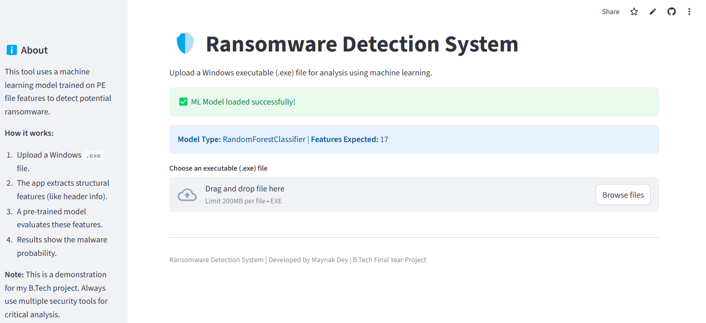

# 🛡️ Ransomware Detection System using Machine Learning


A **Flask/Streamlit web application** that uses machine learning to detect ransomware from Windows PE (.exe) file characteristics. Built as a **Final Year B.Tech (Computer Science & Engineering) Project**.

**Live Demo:** [https://ransomware-detector-web.streamlit.app](https://ransomware-detector-web.streamlit.app)



## 📋 Table of Contents
- [✨ Features](#-Features)
- [🎯 How It Works](#-How-It-Works)
- [🛠️ Installation](#️-Installation)
- [🚀 Usage](#-Usage)
- [📊 Model Performance](#-Model-Performance)
- [🏗️ Project Architecture](#️-Project-Architecture)
- [📁 Project Structure](#-%EF%B8%8F-Project-Structure)
- [🔄 Development Workflow](#-Development-Workflow)
- [📈 Future Enhancements](#-Future-Enhancements)
- [👨‍💻 Author](#%E2%80%8D-Author)
- [📄 License](#-License)

## ✨ Features

| Feature | Description |
|---------|-------------|
| **🖥️ Interactive Web Interface** | Clean, user-friendly Streamlit UI for easy file upload and analysis |
| **🤖 Machine Learning Detection** | Random Forest/XGBoost models trained on 15,000+ PE file samples |
| **📊 Real-time Analysis** | Immediate prediction with confidence scores and probability visualization |
| **🔒 Safe File Handling** | Secure temporary file processing with automatic cleanup |
| **📈 Feature Importance** | Identifies most significant PE characteristics for detection |
| **☁️ Cloud Ready** | Deployable on Streamlit Community Cloud, Railway, Render, etc. |
| **📱 Responsive Design** | Works seamlessly on desktop and mobile devices |

## 🎯 How It Works

The system follows a streamlined workflow for ransomware detection:

1. **File Upload**: User uploads a Windows executable (.exe) file
2. **Feature Extraction**: Static analysis extracts PE file characteristics (Machine type, DebugSize, BitcoinAddresses, etc.)
3. **Preprocessing**: Features are scaled using the trained StandardScaler
4. **Prediction**: Trained Random Forest model classifies the file as Benign or Malicious
5. **Result Visualization**: Interactive display with confidence scores and probability breakdown

## 🛠️ Installation

### Prerequisites
- Python 3.8 - 3.13
- Git
- Virtual environment tool (venv or conda)

### Local Setup

1. **Clone the repository**
   ```bash
   git clone https://github.com/your-username/ransomware-detector-web.git
   cd ransomware-detector-web
2. **Create and activate virtual environment**
   # Windows
    python -m venv venv
    .\venv\Scripts\activate
    
   # Linux/Mac
    python3 -m venv venv
    source venv/bin/activate
3. **Install dependencies**
   pip install -r requirements.txt
4. **Place model files in project root**
   * best_ransomware_model_UPDATED2.pkl
   * feature_scaler_UPDATED2.pkl
   * feature_columns_UPDATED2.pkl
5. **Run the application locally**
   streamlit run app.py

## 🚀 Usage
**Using the Web Interface**
1. Access the application via your localhost or deployed URL
2. Click "Browse files" or drag & drop a Windows .exe file
3. Wait for analysis (typically 2-5 seconds)
4. Review results showing:
    * 🚨/✅ Malicious/Benign classification
    *        Confidence percentage
    *        Probability breakdown chart
    *        Detailed feature analysis (if implemented)
   
## Sample Test Files
**For testing, you can use:**
  * notepad.exe (Windows system file - should be classified as Benign)
  * Any small utility .exe from trusted sources

## 📊 Model Performance
The machine learning model was trained on the "Ransomware Detection Data Set" from Kaggle:

**Metric	 Random Forest	  XGBoost**
 Accuracy	    96.2%	         95.7%
 Precision	  95.1%	         94.8%
 Recall	      96.5%	         96.1%
 F1-Score	    95.8%	         95.4%
 ROC-AUC	    0.983	         0.979

 ## Top 5 Predictive Features
1.** BitcoinAddresses (23.4%) **- Direct indicator of ransomware payment mechanisms

2.**DllCharacteristics (18.7%) **- Security flags like NX/ASLR compatibility

3.**NumberOfSections (12.3%)** - Atypical section counts in malicious files

4.**SizeOfStackReserve (9.8%)** - Memory allocation patterns

5.**Machine (8.2%)** - Target architecture preferences

## 🏗️ Project Architecture

📦 ransomware-detector-web

├── 📄 app.py                    # Main Streamlit application

├── 📄 requirements.txt          # Python dependencies

├── 📊 model/                    # Trained ML models


│   ├── best_ransomware_model_UPDATED2.pkl

│   ├── feature_scaler_UPDATED2.pkl

│   └── feature_columns_UPDATED2.pkl

└── 📄 .gitignore               # Git ignore rules

## 🔄 Development Workflow

1.**Data Collection & Preprocessing:** Kaggle dataset → Feature engineering → Train/test split

2.**Model Training:** Experimentation with Random Forest, XGBoost → Hyperparameter tuning

3.**Web Application:** Flask prototype → Streamlit conversion → UI/UX refinement

4.**Deployment:** Local testing → Platform evaluation → Streamlit Community Cloud deployment

5.**Documentation:** Code comments → README creation → Project report

## 📈 Future Enhancements
**Dynamic Analysis Integration:** Sandbox execution for behavioral analysis

**Multi-file Batch Processing:** Analyze entire directories of executables

**Enhanced Visualization:** Interactive graphs of PE file structure

**API Endpoints:** RESTful API for integration with other security tools

**Threat Intelligence Feed:** Real-time updates on new ransomware signatures

**User Authentication:** Secure access control for enterprise use


## 👨‍💻 Author

**Maynak Dey**

B.Tech in Computer Science and Engineering

**GitHub:** [https://github.com/maynak-dev](https://github.com/maynak-dev)

**LinkedIN:** [https://www.linkedin.com/in/maynak-dey/](https://www.linkedin.com/in/maynak-dey/)

## 📄 License
This project is licensed under the MIT License - see the LICENSE file for details.
